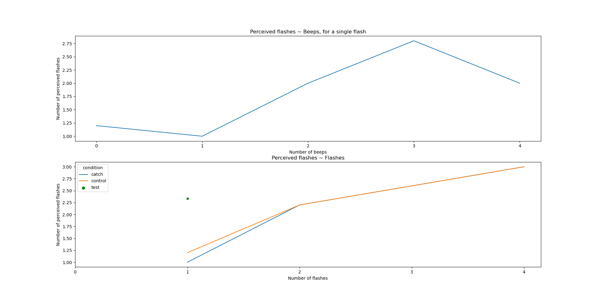

# Shams illusion

## Description

*What you hear is what you see!*

When a single visual flash is accompanied by multiple auditory beeps, the single flash is incorrectly perceived as multiple flashes. 

The aim of this project is to create an audiovisual experiment testing for this cross-modal illusion studied by Ladan Shams and colleagues. You can find the original article dealing with this phenomenon in the repository: [Shams et al.(2000)](Shams_et_al_2000.pdf).

The experiment consists in a succession of trials in which a disk flashes on the screen while beeps are heard, and the participant must indicate, by pressing response keys, how many flashes were seen. 

The values for the stimuli parameters in the experiment code are based on the description of the experiment in Shams et al. (2000).

## Requirements 

The code for the experiment requires the installation of the packages: *expyriment* and *numpy*.
The data analysis code requires the installation of the packages: *expyriment*, *matplotlib.pyplot*, *pandas*, *seaborn*, *scipy*, *glob* and *os*.

## Experimental conditions:

The conditions are: control (0 beep, 1-4 flashes); catch (1 beep, 1-4 flashes); test (2-4 beeps, 1 flash).

The Shams effect is expected to happen during test trials. Catch trials and control trials allow to evaluate how people usually perceive flashes in function of their number. 

Conditions|Beeps/Flashes | 1 | 2 | 3 | 4 
--- | --- | --- | --- | --- | --- 
Control |0 | |||
Catch |1 | |||
Test|2 | |x|x|x
Test |3 | |x|x|x
Test |4 | |x|x|x

The crosses in the table indicate the combinations of stimuli that we won't need in the analysis. We have 11 combinations, and 5x11 trials.

## Solving the timing problem

One thing to solve was the timing of the presentations of stimuli during a trial. 

Circle stimuli in *expyriment* do not get erased on their own, contrary to audio stimuli for which a duration can be set. 
This dramatically complicated the stimulus presentation loop with multiple special cases to take into account as well as unresolved timing issues.

In the end, a simpler way to code this was by iterating over a sorted list of all stimulus events (onset of beeps and flashes and offset of flashes).

## Data analysis

Here are two plots illustrating the Shams effect, obtained from [example data of one subject](https://github.com/charlottedel/shamsillusion/blob/main/data/final_code_xpshams_pilot.xpd).

The first plot shows how the number of beeps affects the perception of a single flash. 

The second one shows how the perception of flashes in function of actual flashes differs when 2 or more beeps are heard (test trials), vs. with 0 to 1 beep 
(control and catch trials). 
